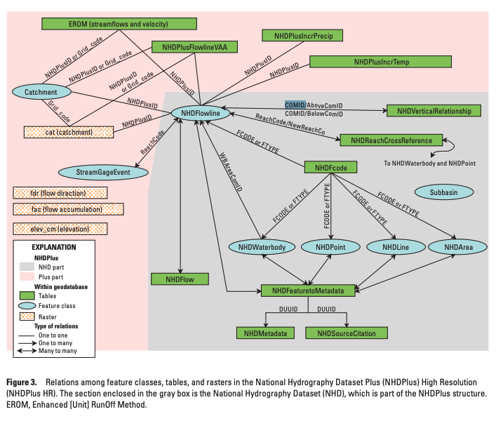

```{r setup, include=FALSE}
knitr::opts_chunk$set(echo = TRUE)

library(tidyverse)
library(sf)

#devtools::install_github("flowwest/rivermile")
library(rivermile)

#install.packages("nhdplusTools")
library(nhdplusTools)

```
Watershed
```{r}
klamath_basin <- sf::st_read(here::here("data-raw", "klamath_basin_outline", "WBDHU8_Klamath_Rogue.shp")) |> 
  filter(!grepl('17', huc8)) 

ggplot() +
  geom_sf(data = klamath_basin) +
  theme_minimal() 
```

## Get Flowline Data 

Using [**nhdplusTools**](https://doi-usgs.github.io/nhdplusTools/articles/get_data_overview.html)


```{r eval=FALSE, include=FALSE}
download_dir <- download_nhdplushr(here::here("data-raw"), 1801)

nhdplushr <- get_hr_data(list.files(download_dir, pattern = ".gdb", full.names = TRUE),
                         layer = "NHDFlowline", rename = TRUE)

nhd_flowline <- nhdplushr |> janitor::clean_names()

saveRDS(nhd_flowline, here::here("data-raw", "shapes", "nhd_flowline_hr.rds"))

```

```{r}
nhd_flowline <- readRDS(here::here("data-raw", "shapes", "nhd_flowline_hr.rds"))

flowline <- nhd_flowline |> 
  st_as_sf() |> 
  st_set_geometry("shape") |> 
  filter(stream_orde > 2) |> 
  glimpse()

klamath_basin <- st_make_valid(klamath_basin)
huc_u <- klamath_basin |> summarise(geometry = st_union(geometry))

flowline <- st_transform(flowline, st_crs(klamath_basin))

flowlines <- st_intersection(flowline, huc_u)

ggplot() +
  geom_sf(data = flowlines) +
  theme_minimal() 

saveRDS(flowlines, here::here("data-raw", "shapes", "nhd_flowline_klamath_basin.rds"))
```
```{r}
knitr::knit_exit()
```

### Download NHD layers for Klamath Basin

-   NHDplus geodatabase downloaded from: <https://www.sciencebase.gov/catalog/item/5d30c29ae4b01d82ce84aa5e>
-   User’s Guide for the National Hydrography
Dataset Plus (NHDPlus) High Resolution: <https://pubs.usgs.gov/of/2019/1096/ofr20191096.pdf>



```{r eval=FALSE, include=FALSE}
# TODO: get this from rivermile library

rivermile::nhd_flowline

```

**NHDPlus Download**

https://www.epa.gov/waterdata/get-nhdplus-national-hydrography-dataset-plus-data

```{r}
layers <- st_layers(here::here("data-raw", "nhdplus_epasnapshot2022_or.gdb"))

nhdflowline_or <- st_read(here::here("data-raw", "nhdplus_epasnapshot2022_or.gdb"), layer =  "nhdflowline_or")

nhdplusflowlinevaa_or <- st_read(here::here("data-raw", "nhdplus_epasnapshot2022_or.gdb"), layer =  "nhdplusflowlinevaa_or")
```
