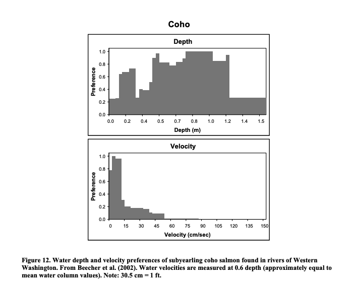

```{r setup, include=FALSE}
library(tidyverse)

knitr::opts_chunk$set(echo = TRUE)
```

```{r include=FALSE}

habitat_data <- read_csv(here::here('data-raw', 'habitat_data.csv')) |> 
  janitor::clean_names() 

```

## Habitat Modeling

The Stream Salmonid Simulator (S3) model incorporates two-dimensional (2D) hydraulic models for specific Klamath River sections to calculate habitat suitability based on environmental variables, such as river flow and channel width. These models use [Weighted Usable Habitat Area (WUA)](https://pubs.usgs.gov/of/2019/1107/ofr20191107_a1.pdf) curves created for specific life stages and habitat types of salmon. The WUA information derived from 2D models (covering 11.3 km or 3.6% of the Klamath's river length) is extrapolated to unmodeled reaches, enabling habitat assessments across larger river sections.

Three S3 models have been developed. The original model was developed to support Fall Run Chinook and later updated to include the Trinity River and Coho populations.

### Reaches

#### Klamath River

Modeled sections on the Klamath include `r paste0(habitat_data |> filter(river == "Klamath River") |> pull(location_name), collapse = ", ")` . The exact location of each reach was estimated using Google Earth. It is also unknown how long each reach extends.

An SRH-1D model was also developed for the Lower Klamath River, below the former location of Iron Gate Dam.

```{r echo=FALSE}
habitat_data |> 
  filter(river == "Klamath River") |> 
  mutate(river_mile = paste0(rm_start, "-", rm_end)) |> 
  select(river, location_name, model_type, river_mile, status) |> 
  knitr::kable()
```

#### Trinity River

The entire 40-mile Restoration Reach of the Trinity River was modeled using SRH-2D. It is currently unclear what the exact extents are.

```{r echo=FALSE}
habitat_data |> 
  filter(river == "Trinity River") |> 
  select(river, location_name, model_type, length_miles, status) |> 
  knitr::kable()

```

#### In Development

-   Resource Environmental Services (RES) is currently developing HEC-EFM models for Jenny Creek, Camp Creek, Beaver Creek, and Spencer Creek. It is unclear the exact extents of these models.

-   Julie Alexander at Oregon State University has developed a 2D hydraulic model for use in analid research; it is unclear the exact extents of this model.

## Habitat Suitability Indices

### Coho

{width="600"}

### Fall Run Chinook

The following HSI was provided in the 2019 *Application of the Stream Salmonid Simulator (S3) to Klamath River fall Chinook salmon (Oncorhynchus tshawytscha), California* report by Perry et al.

{width="600"}

## Sources

### Modeled Habitat 

-   Dodrill, M.J., Perry, R.W., Som, N.A., Manhard, C.V., and Alexander, J.D., 2022, Extending the Stream Salmonid Simulator to accommodate the life history of coho salmon (Oncorhynchus kisutch) in the Klamath River Basin, Northern California: U.S. Geological Survey Open-File Report 2022–1071, 70 p., <https://doi.org/10.3133/ofr20221071.>

-   Hardy et al., 2006. Evaluation of Flow Needs in the Klamath River Phase II. Institute for Natural Systems Engineering, Utah State University.

-   Hardy, T. B., 2012. Technical Memorandum: Revised Coho fry habitat versus discharge relationships for the Klamath River*.* River Systems Institute, Texas State University, San Marcos, TX. April 4.

-   Perry, R.W., Plumb, J.M., Jones, E.C., Som, N.A., Hardy, T.B., and Hetrick, N.J., 2019, Application of the Stream Salmonid Simulator (S3) to Klamath River fall Chinook salmon (Oncorhynchus tshawytscha), California—Parameterization and calibration: U.S. Geological Survey Open-File Report 2019–1107, 89 p., <https://doi.org/10.3133/ofr20191107.>

-   Perry, R.W., Jones, E.C., Plumb, J.M., Som, N.A., Hetrick, N.J., Hardy, T.B., Polos, J.C., Martin, A.C., Alvarez, J.S., and De Juilio, K.P., 2018, Application of the Stream Salmonid Simulator (S3) to the restoration reach of the Trinity River, California—Parameterization and calibration: U.S. Geological Survey Open-File Report 2018-1174, 64 p., <https://doi.org/10.3133/ofr20181174.>

-   Klamath River Renewal Corporation. *Biological Assessment Appendix I - Reservoir Drawdown Hydraulic Model and SRH-1D Suspended Sediment Concentration Model Update Documentation*, 2011, [www.klamathrenewal.org/wp-content/uploads/2021/03/A-10-BA-Appendix-I-%E2%80%93-Reservoir-Drawdown-Hydraulic-Model-and-SRH-1D-Suspended-Sediment-Concentration-Model-and-Update-Documentation.pdf.](www.klamathrenewal.org/wp-content/uploads/2021/03/A-10-BA-Appendix-I-%E2%80%93-Reservoir-Drawdown-Hydraulic-Model-and-SRH-1D-Suspended-Sediment-Concentration-Model-and-Update-Documentation.pdf.)

### Habitat Suitability Indices 

-   Coho Salmon (Oncorhynchus kisutch) Life History Patterns in the Pacific Northwest and California Final Report March 2007; Prepared for USBR by Biostream Environmental <https://coastcoho.org/wp-content/uploads/2022/03/Coho-Salmon-Life-History-Patterns-in-the-Pacific-Northwest-_-California.pdf>

## 
